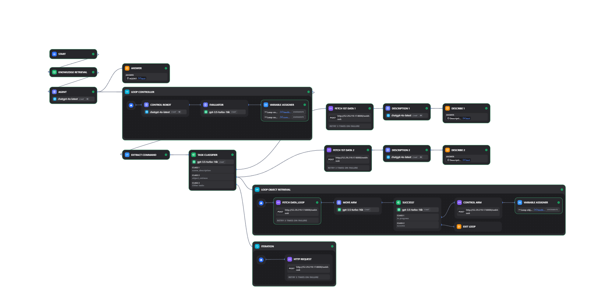
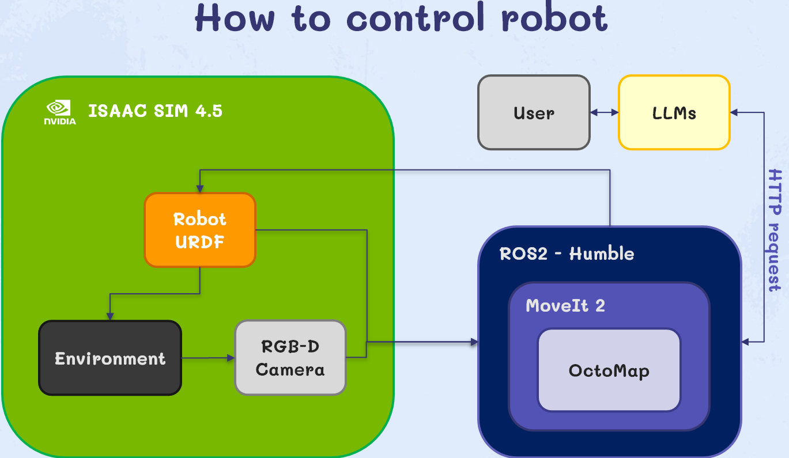

# LLM‑Driven Assistive Robotic Arm

**Franka Emika Panda + ROS 2 MoveIt 2 + Isaac Sim 4.5 + Dify**

Video demonstration: https://youtu.be/8X_k8fNZt_k

## Dify Framework Overview



## How to Control the Robot


## Overview

This repo shows how to:

* Load Panda URDF from [`franka_description`](https://github.com/frankarobotics/franka_description)
* Plan/execute motions with **ROS 2 Humble + MoveIt 2**
* Simulate in **Isaac Sim 4.5** with ROS 2 bridge
* Control via **Dify LLM agent** using natural language commands

Repository: [S-Kia/LLM-Driven-Robotic-Arm-Advancing-Assistive-Technologies](https://github.com/S-Kia/LLM-Driven-Robotic-Arm-Advancing-Assistive-Technologies.git)

## Quickstart

**1) Setup**

```bash
mkdir -p ~/ws_franka/src && cd ~/ws_franka/src
git clone https://github.com/S-Kia/LLM-Driven-Robotic-Arm-Advancing-Assistive-Technologies.git

# URDF
git clone https://github.com/frankarobotics/franka_description
```

**2) Launch MoveIt 2**

```bash
source /opt/ros/humble/setup.bash
cd ~/ros2_ws
colcon build --symlink-install
source install/setup.bash

source ~/ws_moveit/install/setup.bash
ros2 launch franka_arm demo.launch.py
```

**3) Isaac Sim**

* Enable `omni.isaac.ros2_bridge`
* Load Panda USD, start ROS 2 bridge

**4) Dify Agent → ROS 2**

```bash
cd ~/ros2_ws/src/franka_arm/scripts
python server.py
```

## Structure

```
franka_arm/
franka_description/  # USDs, meshes
```

## Example Task

User: “Pick up the cup from the shelf.” → Dify interprets → ROS 2 plan via MoveIt 2 → Robot executes.

## License

MIT
